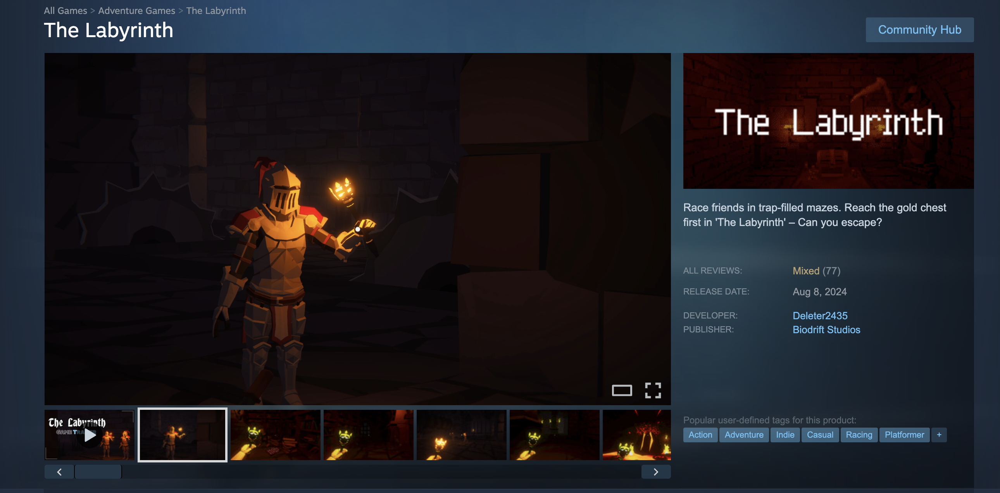

## The Labyrinth
**Description:** Simple summary of the game mechanics.
- **Engine:** Pygame / Unity.

<a href="https://store.steampowered.com/app/2664560/The_Labyrinth/">
  
  <strong>Available on Steam</strong>
</a>

{: style="border: 2px solid #555; border-radius: 10px;"}

- [Play Demo / View Code](https://github.com/andycheng2018/The-Labyrinth)

## Mecha Smash
**Description:** Simple summary of the game mechanics.
- **Engine:** Pygame / Unity.
- [Play Demo / View Code](https://hackerzilla.itch.io/mecha-smash)

## Biodrift
**Description:** Simple summary of the game mechanics.
- **Engine:** Pygame / Unity.
- [Play Demo / View Code](https://github.com/andycheng2018/Biodrift)

## Loop Game Jam
**Description:** Simple summary of the game mechanics.
- **Engine:** Pygame / Unity.
- [Play Demo / View Code](https://github.com/hackerzilla/LOOP-game-jam)
